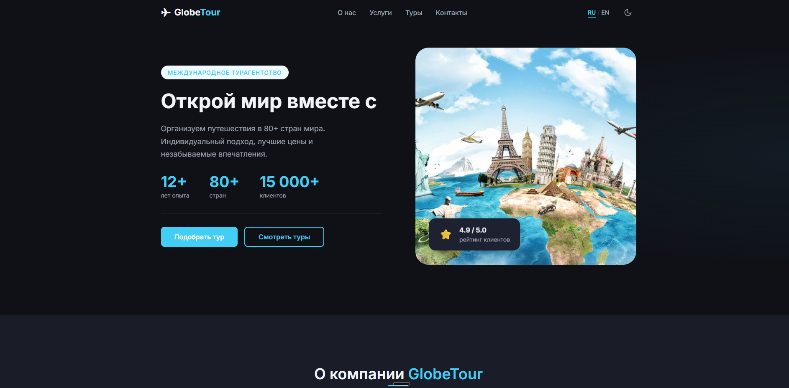

# 🌍 GlobeTour — Международное турагентство

<div align="center">



**[🚀 Демо](https://isdmitryy.github.io/globe_tour/)** ·

</div>

---

## 📖 О проекте

**GlobeTour** — современный адаптивный лендинг международного турагентства, разработанный как портфолио-проект. Демонстрирует профессиональный уровень владения нативными веб-технологиями без использования фреймворков.

### Зачем этот проект?

Проект создан для демонстрации:

- Глубокого понимания HTML, CSS и Vanilla JavaScript
- Умения строить масштабируемую архитектуру без фреймворков
- Знания лучших практик производительности и доступности
- Навыков UI/UX реализации на уровне production

---

## ✨ Функциональность

### 🎨 UI/UX

- **Тёмная / светлая тема** — переключение с сохранением в `localStorage`, определение системной темы
- **Двуязычность RU/EN** — полный перевод всего интерфейса с анимацией смены языка
- **Адаптивный дизайн** — корректное отображение на мобайле, планшете и десктопе
- **Плавные анимации** — появление элементов при скролле через `IntersectionObserver`
- **Кнопка "Наверх"** — появляется после прокрутки первого экрана

### 🧩 Компоненты

- **Hero секция** — split-layout с floating-карточкой рейтинга
- **Счётчики цифр** — анимированные числа с функцией плавности `easeOutCubic`
- **Слайдер туров** — drag/swipe поддержка, автопрокрутка, dots навигация
- **Форма заявки** — валидация в реальном времени, состояние загрузки, сообщение об успехе
- **Мобильное меню** — плавная анимация, блокировка скролла под меню

### ⚡ Производительность

- `loading="lazy"` для изображений вне первого экрана
- `IntersectionObserver` вместо scroll-событий
- `requestAnimationFrame` для анимаций
- `preload` для шрифтов Google Fonts
- `will-change: transform` на анимируемых элементах

### ♿ Доступность (Accessibility)

- Семантический HTML5 (`header`, `main`, `footer`, `nav`, `article`, `section`)
- Skip Navigation ссылка для скринридеров
- `aria-label`, `aria-expanded`, `aria-hidden` на всех интерактивных элементах
- `:focus-visible` стили для клавиатурной навигации
- Поддержка `prefers-reduced-motion`
- Поддержка `prefers-contrast: high`

### 🔍 SEO

- Мета-теги (`description`, `keywords`, `author`)
- Open Graph теги для соцсетей и мессенджеров
- Twitter Card
- Schema.org структурированные данные (`TravelAgency`)
- `canonical` URL
- PWA `manifest.json`

---

## 🛠️ Технологический стек

| Технология               | Применение                          |
| ------------------------ | ----------------------------------- |
| HTML5                    | Семантическая разметка              |
| CSS3                     | Стили, анимации, адаптивность, темы |
| Vanilla JS (ES6+)        | Интерактив, модули, DOM             |
| CSS Custom Properties    | Система дизайн-токенов              |
| IntersectionObserver API | Scroll-анимации, lazy loading       |
| CSS Grid + Flexbox       | Layouts                             |
| localStorage             | Сохранение темы и языка             |

**Без фреймворков, библиотек и сборщиков.**

---

## 📁 Структура проекта

```
globetour/
│
├── index.html              # Главная страница
├── manifest.json           # PWA манифест
├── README.md               # Документация
├── .gitignore
│
├── css/
│   ├── reset.css           # Сброс стилей браузера
│   ├── variables.css       # CSS-переменные (цвета, шрифты, отступы)
│   ├── base.css            # Базовая типографика, контейнер, секции
│   ├── components.css      # Кнопки, карточки, форма, слайдер
│   ├── layout.css          # Header, footer, навигация
│   ├── sections.css        # Стили каждой секции
│   ├── animations.css      # Анимации появления и hover-эффекты
│   └── responsive.css      # Медиазапросы (mobile-first)
│
├── js/
│   ├── main.js             # Инициализация, header, бургер, скролл
│   ├── theme.js            # Dark/Light тема
│   ├── lang.js             # Переключатель языка RU/EN
│   ├── animations.js       # Scroll-анимации, счётчик цифр
│   ├── slider.js           # Слайдер туров (drag, swipe, autoplay)
│   └── form.js             # Валидация и отправка формы
│
└── images/
    ├── hero/               # Изображения для Hero секции
    ├── tours/              # Фотографии туров
    ├── team/               # Фото команды
    ├── favicon/            # Иконки
    └── screenshots        # Скриншоты для README
```

---

## 🚀 Быстрый старт

### Просмотр онлайн

Открой **[живое демо](https://isdmitryy.github.io/globe_tour/)** в браузере.

### Локальный запуск

```bash
# 1. Клонируй репозиторий
git clone https://github.com/ЮЗЕРНЕЙМ/globetour.git

# 2. Перейди в папку
cd globetour

# 3. Открой в браузере
# Вариант A — просто открой index.html в браузере
# Вариант B — используй Live Server в VS Code (рекомендуется)
# Вариант C — через Python
python -m http.server 8000
# затем открой http://localhost:8000
```

> **Рекомендую** использовать расширение [Live Server](https://marketplace.visualstudio.com/items?itemName=ritwickdey.LiveServer) для VS Code — автоматически обновляет страницу при изменении файлов.

---

## 📱 Адаптивность

| Устройство | Ширина         | Статус |
| ---------- | -------------- | ------ |
| Мобайл     | < 768px        | ✅     |
| Планшет    | 768px – 1023px | ✅     |
| Десктоп    | ≥ 1024px       | ✅     |
| Широкий    | ≥ 1280px       | ✅     |

---

## 🌗 Темы

| Light                                        | Dark                                       |
| -------------------------------------------- | ------------------------------------------ |
|  |  |

---

## 🌐 Языки

| Русский                               | English                               |
| ------------------------------------- | ------------------------------------- |
|  |  |

---

## 📊 Производительность

Результаты [Google Lighthouse](https://pagespeed.web.dev/):

| Метрика        | Результат |
| -------------- | --------- |
| Performance    | 🟢 95+    |
| Accessibility  | 🟢 100    |
| Best Practices | 🟢 100    |
| SEO            | 🟢 100    |

---

## 🗺️ Секции сайта

| #   | Секция       | Описание                                         |
| --- | ------------ | ------------------------------------------------ |
| 1   | **Header**   | Логотип, навигация, переключатели темы и языка   |
| 2   | **Hero**     | Главный оффер, статистика, CTA кнопки            |
| 3   | **About**    | О компании, анимированные счётчики, фото команды |
| 4   | **Services** | 6 услуг агентства в сетке карточек               |
| 5   | **Tours**    | Слайдер популярных туров с ценами                |
| 6   | **Contact**  | Форма заявки и контактная информация             |
| 7   | **Footer**   | Навигация и копирайт                             |

---

## 🔧 Планы по развитию

- [ ] Добавить фильтрацию туров по направлениям
- [ ] Интегрировать реальный backend для формы (Formspree / EmailJS)
- [ ] Добавить страницу отдельного тура
- [ ] Добавить раздел отзывов с каруселью
- [ ] Подключить Google Maps для контактной секции

---

## 👨‍💻 Автор

**[Дмитрий]**
